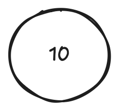
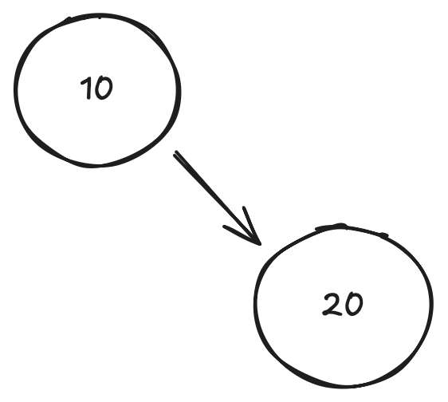
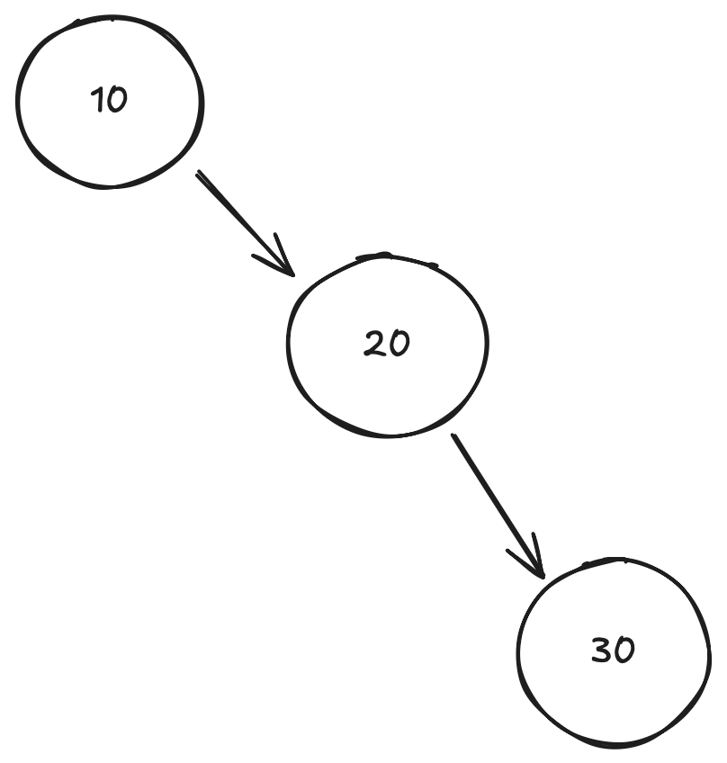

## Jose Marquez
## Repo: 3013 - Advance Structures

## Assignment 05 - AVL tree (Insertions with Multiple Rotations)

## Left - Right and Right Lef Rotations

**Set : 10, 20, 30, 15, 25, 5, 35, 27**

| **Insert 10 (Img01)** |
|:---:|
||
| BF(10) = 0 (Balanced) |

| **Insert 20 (Img02)** |
| :-----:|
||
| BF (20) = 0 - 1 = -1 (Balanced) |

**Insert 30 (Img03)**

- BF (30) = 0
- Bf (20) = -1
- BF (10) = 0 - 2 = -2  **Imbalance (Right-Right at 10)**

