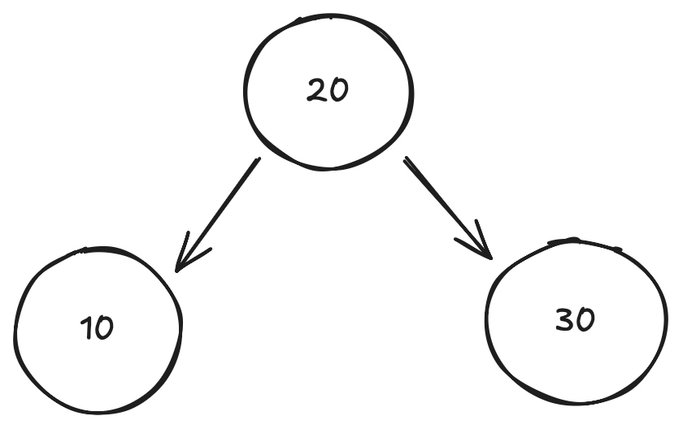
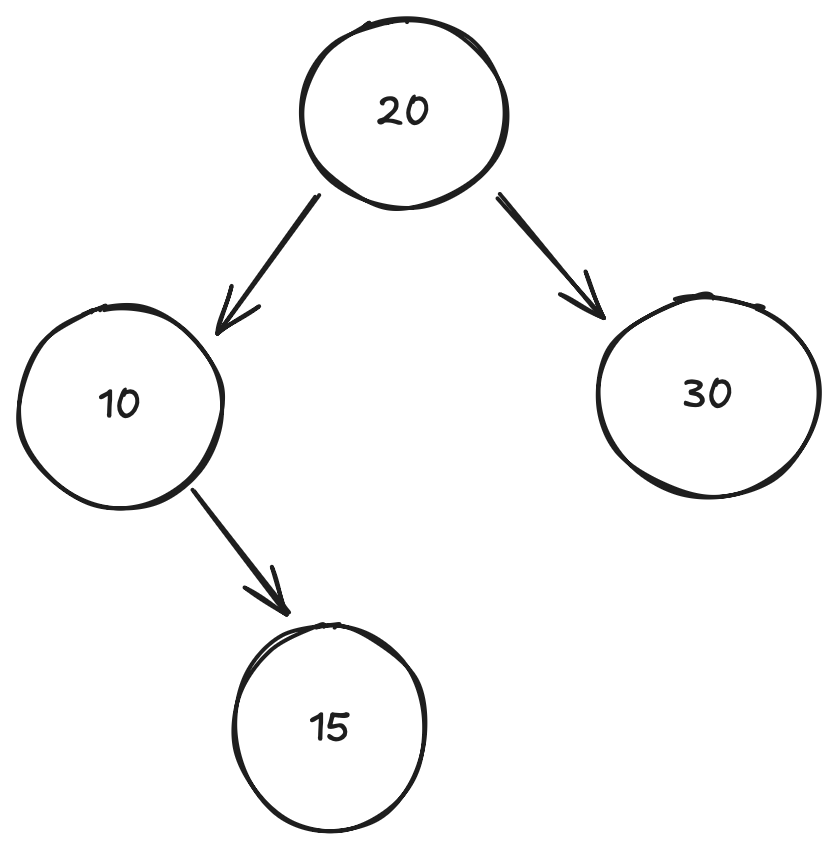
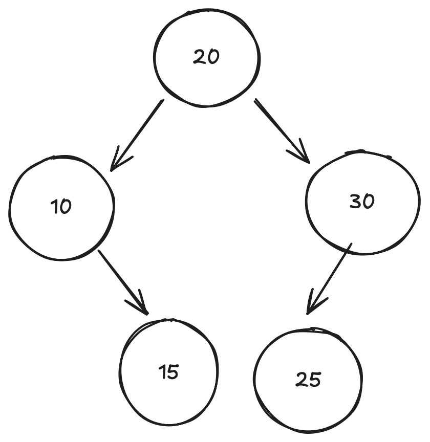
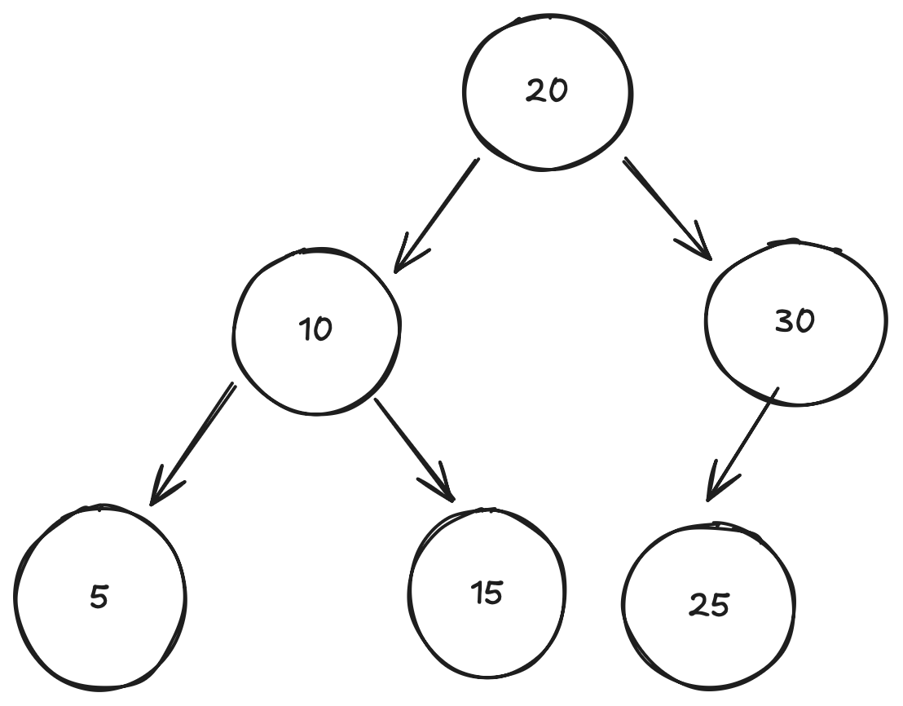
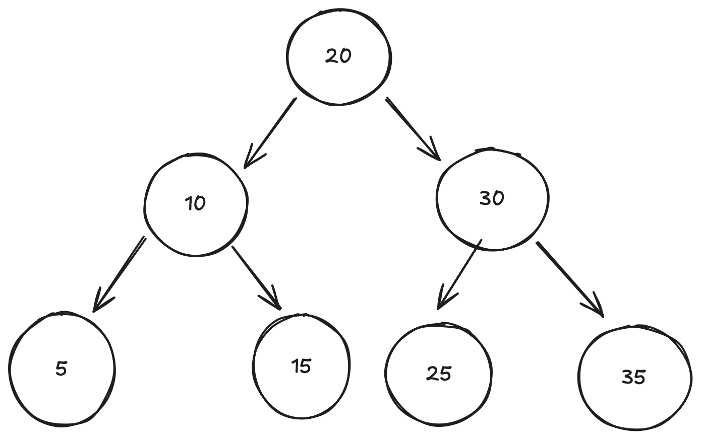
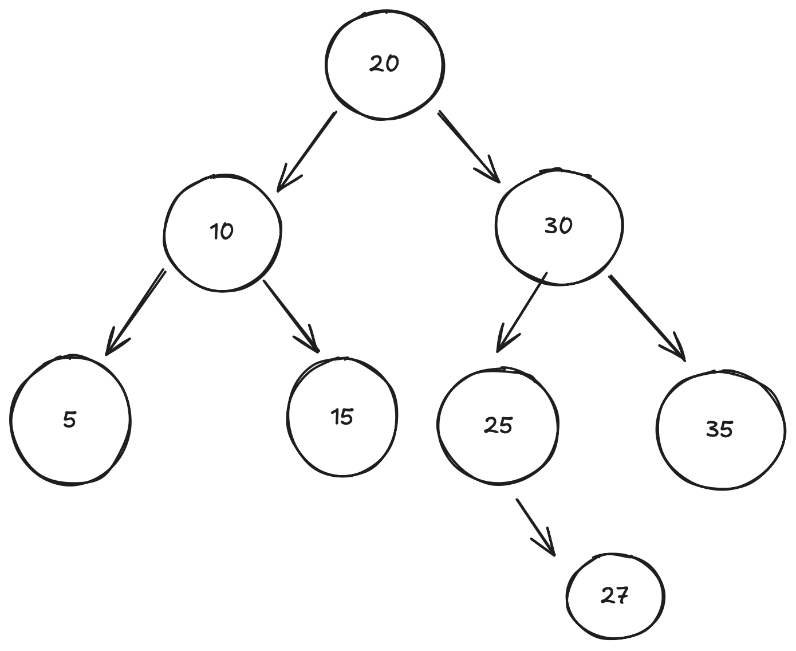

## Jose Marquez
## Repo: 3013 - Advance Structures

## Assignment 05 - AVL tree (Insertions with Multiple Rotations)

## Left - Right and Right Lef Rotations

**Set : 10, 20, 30, 15, 25, 5, 35, 27**

| **Insert 10 (Img01)** |
|:---:|
||
| BF(10) = 0 (Balanced) |

| **Insert 20 (Img02)** |
| :-----:|
||
| BF (20) = 0 - 1 = -1 (Balanced) |

| **Insert 30 (Img03)** |
|:---:|
||
| BF (30) = 0 |
| BF (20) = -1 |
| BF (10) = 0 - 2 = -2  
| **Imbalance (Right-Right at 10)** |

| **Rotation RR (Right-Right) at 10** |
| :---: |
||
|BF (10) = 0 |
|BF (30) = 0 |
|BF (20) = 0 |
| Balanced after rotation |

| **Insert 15 (Img05)** |
| :---: |
||
|BF (15) = 0 |
|BF (10) = 0 - 1 = -1 |
|BF (20) = 1 - 1 = 0 (Balanced) |

| **Insert 25 (Img06)** |
| :---: |
||
|BF (25) = 0 |
|BF (30) = 1 - 0 = 1 |
|BF (20) = 1 - 2 = -1 (Balanced) |

| **Insert 5 (Img07)** |
| :---: |
||
|BF (5) = 0 |
|BF (10) = 1 - 1 = 0 |
|BF (20) = 2 - 2 = 0 (Balanced) |

| **Insert 35 (Img08)** |
| :---: |
||
|BF (35) = 0 |
|BF (30) = 1 - 1 = 0 |
|BF (20) = 2 - 2 = 0 (Balanced) |

| **Insert 27 (Img09)** |
| :---: |
||
|BF (27) = 0 |
|BF (25) = 0 - 1 = -1 |
|BF (30) = 2 - 1 = 1  |
|BF (20) = 2 - 3 = -1 |

| **Final AVL Tree** |
| :---: |
||
| **Balanced after all insertions and rotatios |

