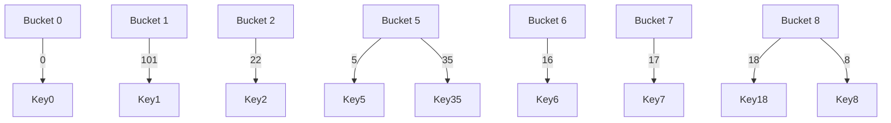
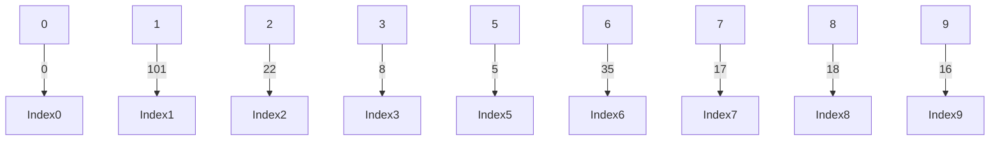

## Jose Marquez
## Repo: 3013 - Advanced Structures

## Assignment 06: Hashing - Strategies and Collision Resolution

## Part A: Conceptual Questions

1. **Define Hashing and Collision Resolution**
   
    - **What is a hash table and why is collision resolution necessary?** A hash table is a data structure that allows efficient storage and retrieval of key-value pairs using a hash function to map keys to indices in an array. This mapping allows for average O(1) time complexity for insertions, deletions, and lookups.
  
    - **Explain the key differences between open hashing (chaining) and closed hashing (open addressing).**
  
    | **Aspect**                | **Open Hashing (chaining)**  | **Closed Hashing (open addressing)** |
    |---------------------------|----------------------------|--------------------------------------|
    | **Storage Method**        | Uses a linked list (or another data structure) at each index to store multiple keys. | Stores all elements directly in the hash table array. |
    | **Collision Handling**    | New elements are appended to a list at the same index. | A different index is found using a probing technique (linear probing, quadratic probing, double hashing). |
    | **Memory Usage**          | Requires extra memory for pointers (linked list). | Uses only the fixed array space, leading to a better cache efficiency. |
    | **Efficiency**            | Lookup is O(1) on average but O(n) is worst case scenario | Lookup can become slow (O(n)) when many collisions occur. |
    | **Deletion Complexity**   | Easier to delete elements without disrupting table structure | Deletion requires marking positions as "delete" or rehashing elements. |
    

    2. **Collision Resolution Techniques**

   - **Briefly describe at least two methods for resolving collisions in open addressing (e.g., linear probing, quadratic probing, double hashing).** 
  
      1. **Linear probing**: In linear probing, if a collision occurs at index h(k), the algorithm checks the next available slot in a sequential manner h(k + 1) % TableSize, h(k + 2) % TableSize, and so on, until an empty slot is found.
   
      2. **Double Hashing**: Uses a second hash function to determine the probing step size: h2(k). The new index is computed as (h1(k)+ i * h2(k)) % TableSize, where i is the number of attempts.
   
   - ## Explain the pros and cons of each method
  
 ### **Linear Probing**  

  **Pros:**
  - Simple to implement.
  - Good cache performance due to sequential memory access.

  **Cons:**
  - Prone to primary clustering (many keys clustering together), increasing search time.
  - Performance degrades as the table becomes full.

  ### **Double Hashing**  

  **Pros:**
  - Minimizes clustering issues (both primary and secondary).
  - Ensures better distribution of keys.

  **Cons:**
  - Requires an additional hash function.
  - Performance depends on the quality of the second hash function.
  - **Worst-Case Big-O:** O(n), when the second hash function results in poor distribution or when the table is
  
   - ## Which collision resolution technique can handle more values than table slots. Explain.
  
      - None of the open addressing methods can handle more values than available slots because open addressing stores all elements inside the table itself. If the table is full, no more insertions are possible. In contrast, chaining (linked lists at each index) can handle more values than the number of slots.
  
   - ## What is the worst performance (Big-O) for each type of collision resolution technique?

  | **Collision Resolution Technique** | **Worst-Case Time Complexity (Big-O)** | **Reasoning** |
  |------------------------------------|---------------------------------|------------------------------------------------|
  | **Linear Probing**                 | **O(n)**                        | When many elements collide, a long sequence of occupied slots may need to be checked before finding an empty one. |
  | **Quadratic Probing**              | **O(n)**                        | Similar to linear probing, but avoids primary clustering. In worst cases, searching for a free slot can still take linear time. |
  | **Double Hashing**                 | **O(n)**                        | If the second hash function does not generate a good spread, probing may check a large number of slots before finding an empty one. |
  | **Chaining (Separate Linked Lists)** | **O(n)**                        | If all elements hash to the same bucket, searching through a long linked list takes O(n) time. |


  ## Part B: Simulation and Diagram Exercises

 ### Exercise 1: Open Hashing (Separate Chaining)

 Given the following set of keys:


$5, 22, 17, 18, 35, 101, 16, 0, 8$


### **Step 1: Compute the Hash Values**

Using the division method hash function:

\[
    h(k) = k mod 10.
\]

|  Key      | Hash Value (k mod 10) | Bucket |
|-----------|-----------------------|--------|
| 5         |  5                    | 5      |
| 22        | 22 mod 10 = 2         | 2      |
| 17        | 17 mod 10 = 7         | 7      |
| 18        | 18 mod 10 = 8         | 8      |
| 35        | 35 mod 10 = 5         | 5      |
| 101       | 101 mod 10 = 1        | 1      |
|  16       | 16 mod 10 = 6         | 6      |
|  0        | 0 mod 10 = 0          | 0      |
|  8        | 8 mod 10 = 8          | 8      |


### **Step 2: Diagram Representation**




### **Step 3: Construct the Hash Table**

| Index | Values (Linked List)      |
|-------|---------------------------|
| 0     | 0                         |
| 1     | 101                       |
| 2     | 22                        |
| 3     | (empty)                  |
| 4     | (empty)                  |
| 5     | 5 → 35                    |
| 6     | 16                        |
| 7     | 17                        |
| 8     | 18 → 8                   |
| 9     | (empty)                  |


### **Step 4: Identify Collisions** 

 **Note: Collisions occur when multiples keys are mapped to the same index.**


- **Bucket 5** has a collision 5 --> 35 (2 elements)
- **Bucket 8** has a collision 18 --> 8 (2 elements)
- **The largest linked list contains 2 elements**


### Exercise 2: Closed Hashing (Open Addressing)

 Given the following set of keys:


$5, 22, 17, 18, 35, 101, 16, 0, 8$


### **Step 1: Compute Initial Hash values** 


\[
    h(k) = k mod 10.
\]

|  Key      | Hash Value (k mod 10) | Bucket (Before Collision) |
|-----------|-----------------------|--------|
| 5         |  5                    | 5      |
| 22        | 22 mod 10 = 2         | 2      |
| 17        | 17 mod 10 = 7         | 7      |
| 18        | 18 mod 10 = 8         | 8      |
| 35        | 35 mod 10 = 5         | 5 (Collision with 5) |
| 101       | 101 mod 10 = 1        | 1      |
|  16       | 16 mod 10 = 6         | 6      |
|  0        | 0 mod 10 = 0          | 0      |
|  8        | 8 mod 10 = 8          | 8 (Collision with 18) |


### **Step 2: Resolve Collisions using Linear Probing**


|  Key      | Hash Value (k mod 10) | Collision? | Final Bucket (after Linear Probing) |
|-----------|-----------------------|--------|-------------------------------------|
| 5         |  5                    | No     |                5                    |
| 22        | 22 mod 10 = 2         | No     |                2                    |
| 17        | 17 mod 10 = 7         | No     |                7                    |
| 18        | 18 mod 10 = 8         | No     |                8                    |
| 35        | 35 mod 10 = 5         | Yes    | 5 is occupied  6 is next available  |
| 101       | 101 mod 10 = 1        | No     |                1                    |
|  16       | 16 mod 10 = 6         | Yes    | 6 is occupied  9 is next available  |
|  0        | 0 mod 10 = 0          | No     |                0                    |
|  8        | 8 mod 10 = 8          | Yes    | 8 is occupied  3 is next available  |


### **Step 3: Diagram Representation**




### **Step 4: Final Hash Table**


| Index | Values (Linked List)      |
|-------|---------------------------|
| 0     | 0                         |
| 1     | 101                       |
| 2     | 22                        |
| 3     | 8  <-- Collision resolved |
| 4     | (empty)                   |
| 5     | 5                         |
| 6     | 35 <-- Collision resolved |
| 7     | 17                        |
| 8     | 18                        |
| 9     | 16 <-- Collision resolved |


### Exercise 3: Impact of Poor Table Sizes

. **Consider the set of keys:**
     ```
     5, 10, 15, 20, 25, 30, 35, 40
     ```

\[
    h(k) = k mod TableSize
\]

 ### **Step 1: Compute the Hash Values**


**For Table Size = 10**

|  Key      | Hash Value (k mod 10) | Bucket |
|-----------|-----------------------|--------|
| 5         |  5 mod 10 = 5         | 5      |
| 10        | 10 mod 10 = 0         | 0      |
| 15        | 15 mod 10 = 5         | 5 (Collision) |
| 20        | 20 mod 10 = 0         | 0 (Collision) |
| 25        | 25 mod 10 = 5         | 5 (Collision) |
| 30        | 30 mod 10 = 0         | 0 (Collision) |
| 35        | 35 mod 10 = 5         | 5 (Collision) |
| 40        | 40 mod 10 = 0         | 0 (Collision) |


**For Table Size = 11**

|  Key      | Hash Value (k mod 11) | Bucket |
|-----------|-----------------------|--------|
| 5         |  5 mod 11 = 5         | 5      |
| 10        | 10 mod 11 = 10        | 10     |
| 15        | 15 mod 11 = 4         | 4      |
| 20        | 20 mod 11 = 9         | 9      |
| 25        | 25 mod 11 = 3         | 3      |
| 30        | 30 mod 11 = 8         | 8      |
| 35        | 35 mod 11 = 2         | 2      |
| 40        | 40 mod 11 = 7         | 7      |


### **Step 2: Construct the Hash Tables**


 **For Table Size = 10**

| Index | Values (Chained List if necessary)      |
|-------|-----------------------------------------|
| 0     | 10 → 20 → 30 → 40  (Collisions)        |
| 1     | (empty)                                |
| 2     | (empty)                                |
| 3     | (empty)                                |
| 4     | (empty)                                |
| 5     | 5 → 15 → 25 → 35  (Collisions)         |
| 6     | (empty)                                |
| 7     | (empty)                                |
| 8     | (empty)                                |
| 9     | (empty)                                |

 **Observations:**

  1. Clustering at index 0 and 5.
  2. Very poor distribution, most keys are only stored in 2 buckets. 


 **For Table Size = 11**

| Index | Values  |
|-------|---------|
| 0     | (empty) |
| 1     | (empty) |
| 2     | 35      |
| 3     | 25      |
| 4     | 15      |
| 5     | 5       |
| 6     | (empty) |
| 7     | 40      |
| 8     | 30      |
| 9     | 20      |
| 10    | 10      |

**Observations:**

  1. Evenly distributed keys across multiple indices.
  2. No clustering or collisions.


### **Step 3: Discussion**

1. **Why is the table size of 10 a poor choice?**
   - Since **10 is not prime**, many keys end up in the same bucket due to common factors.
   - **Clustering occurs** at index **0** and **5**.
   - **Too many collisions**, which degrade search performance.

2. **Why is the table size of 11 a better choice?**
   - **11 is a prime number**, reducing patterns in key distribution.
   - **Each key maps to a unique bucket**, preventing clustering.
   - **No collisions or clustering occur**, ensuring even distribution.


## Part C: Reflection & Short-Answer Questions (Optional)

### **1. Real-World Impact**
#### **How does choosing a poor hash table size lead to performance degradation in real-world applications?**
- A **poorly chosen hash table size** (e.g., a non-prime number or one too small) increases **collision frequency**, leading to:
  - **Primary Clustering** (in linear probing) – long sequences of occupied slots slow down insertions and lookups.
  - **Uneven Distribution** – certain indices become overloaded while others remain empty.
  - **Longer Search Times** – as more collisions occur, resolving them takes longer, reducing efficiency.
  - **Higher Memory Usage** – additional data structures (like linked lists in chaining) may be needed.

- **Example:**  
  In **database indexing**, an inefficient hash table can **slow down queries**, causing significant performance issues for large-scale systems like banking transactions or recommendation engines.

#### **How do open and closed hashing strategies differ in their handling of collisions in high-load scenarios?**
| **Aspect**             | **Open Hashing (Chaining)** | **Closed Hashing (Open Addressing)** |
|------------------------|---------------------------|--------------------------------------|
| **Handling of Collisions** | Stores multiple values in a linked list at each index. | Finds the next available slot using probing (linear, quadratic, or double hashing). |
| **Performance in High-Load** | **More flexible**—buckets can grow dynamically. Slower if lists become too long. | **Degrades quickly** as table fills up (longer probe sequences). |
| **Memory Usage**       | Extra memory for pointers but efficient in handling high loads. | Fixed memory usage, but performance drops significantly at high loads. |
| **Search Complexity**  | O(1) on average, O(n) in the worst case (long chains). | O(1) on average, O(n) in the worst case (long probe sequences). |

- **Example:**  
  - Open Hashing is **better for web caching** where high-load bursts occur unpredictably.  
  - Closed Hashing is **better for embedded systems** where memory is fixed.

---

### **2. Design Considerations**
#### **If you were to design a hash table for a high-frequency trading system where every millisecond counts, which collision resolution strategy might you choose and why?**
- **Best Choice: Open Addressing with Double Hashing**
  - **Why?**
    - **Fast lookups** – Avoids linked lists, which may require additional memory access.
    - **Minimizes clustering** – Uses a secondary hash function to distribute keys better.
    - **Efficient memory usage** – No extra memory for linked lists.
  - **Alternative:** If the system has enough memory, a **perfect hash function** (precomputed hash map) would be even faster.

- **Example:**  
  - **Stock Market Algorithms** require nanosecond-level performance. A well-designed **open addressing scheme** (with a good secondary hash function) can ensure minimal collisions and faster execution.

---

### **3. Extension**
#### **How might you combine the benefits of chaining and open addressing to design a hybrid hash table?**
- **Hybrid Approach: Adaptive Hashing**
  - **Primary Storage:** Uses **open addressing** (e.g., linear probing) for small load factors.
  - **Secondary Storage:** If a slot gets too many collisions, it converts into **chaining** dynamically.
  - **Load Balancing:** When load factor exceeds a threshold, it **switches to chaining for that bucket**.

- **Benefits:**
  - **Fast lookups in low-collision cases** (open addressing).
  - **Handles high-load scenarios better** by switching to chaining.
  - **Memory-efficient** – avoids overhead of linked lists unless necessary.

- **Example:**  
  - **Database caching systems** use adaptive techniques to switch between probing and chaining based on system load.

---

### **Final Thoughts**
- **Choosing the right hash table strategy depends on:**  
  - **Memory constraints**
  - **Expected load factor**
  - **Performance requirements**  
- **Hybrid models** can provide the best of both worlds, offering speed in normal conditions and flexibility under high load.
