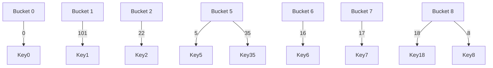

## Jose Marquez
## Repo: 3013 - Advanced Structures

## Assignment 06: Hashing - Strategies and Collision Resolution

## Part A: Conceptual Questions

1. **Define Hashing and Collision Resolution**
   
    - **What is a hash table and why is collision resolution necessary?** A hash table is a data structure that allows efficient storage and retrieval of key-value pairs using a hash function to map keys to indices in an array. This mapping allows for average O(1) time complexity for insertions, deletions, and lookups.
  
    - **Explain the key differences between open hashing (chaining) and closed hashing (open addressing).**
  
    | **Aspect**                | **Open Hashing (chaining)**  | **Closed Hashing (open addressing)** |
    |---------------------------|----------------------------|--------------------------------------|
    | **Storage Method**        | Uses a linked list (or another data structure) at each index to store multiple keys. | Stores all elements directly in the hash table array. |
    | **Collision Handling**    | New elements are appended to a list at the same index. | A different index is found using a probing technique (linear probing, quadratic probing, double hashing). |
    | **Memory Usage**          | Requires extra memory for pointers (linked list). | Uses only the fixed array space, leading to a better cache efficiency. |
    | **Efficiency**            | Lookup is O(1) on average but O(n) is worst case scenario | Lookup can become slow (O(n)) when many collisions occur. |
    | **Deletion Complexity**   | Easier to delete elements without disrupting table structure | Deletion requires marking positions as "delete" or rehashing elements. |
    

    2. **Collision Resolution Techniques**

   - **Briefly describe at least two methods for resolving collisions in open addressing (e.g., linear probing, quadratic probing, double hashing).** 
  
      1. **Linear probing**: In linear probing, if a collision occurs at index h(k), the algorithm checks the next available slot in a sequential manner h(k + 1) % TableSize, h(k + 2) % TableSize, and so on, until an empty slot is found.
   
      2. **Double Hashing**: Uses a second hash function to determine the probing step size: h2(k). The new index is computed as (h1(k)+ i * h2(k)) % TableSize, where i is the number of attempts.
   
   - ## Explain the pros and cons of each method
  
 ### **Linear Probing**  

  **Pros:**
  - Simple to implement.
  - Good cache performance due to sequential memory access.

  **Cons:**
  - Prone to primary clustering (many keys clustering together), increasing search time.
  - Performance degrades as the table becomes full.

  ### **Double Hashing**  

  **Pros:**
  - Minimizes clustering issues (both primary and secondary).
  - Ensures better distribution of keys.

  **Cons:**
  - Requires an additional hash function.
  - Performance depends on the quality of the second hash function.
  - **Worst-Case Big-O:** O(n), when the second hash function results in poor distribution or when the table is
  
   - ## Which collision resolution technique can handle more values than table slots. Explain.
  
      - None of the open addressing methods can handle more values than available slots because open addressing stores all elements inside the table itself. If the table is full, no more insertions are possible. In contrast, chaining (linked lists at each index) can handle more values than the number of slots.
  
   - ## What is the worst performance (Big-O) for each type of collision resolution technique?

  | **Collision Resolution Technique** | **Worst-Case Time Complexity (Big-O)** | **Reasoning** |
  |------------------------------------|---------------------------------|------------------------------------------------|
  | **Linear Probing**                 | **O(n)**                        | When many elements collide, a long sequence of occupied slots may need to be checked before finding an empty one. |
  | **Quadratic Probing**              | **O(n)**                        | Similar to linear probing, but avoids primary clustering. In worst cases, searching for a free slot can still take linear time. |
  | **Double Hashing**                 | **O(n)**                        | If the second hash function does not generate a good spread, probing may check a large number of slots before finding an empty one. |
  | **Chaining (Separate Linked Lists)** | **O(n)**                        | If all elements hash to the same bucket, searching through a long linked list takes O(n) time. |

  ## Part B: Simulation and Diagram Exercises

 ### Exercise 1: Open Hashing (Separate Chaining)

 Given the following set of keys:

$5, 22, 17, 18, 35, 101, 16, 0, 8$

### **Step 1: Compute the Hash Values**

Using the division method hash function:

\[
    h(k) = k mod 10.
\]

|  Key      | Hash Value (k mod 10) | Bucket |
|-----------|-----------------------|--------|
| 5         |  5                    | 5      |
| 22        | 22 mod 10 = 2         | 2      |
| 17        | 17 mod 10 = 7         | 7      |
| 18        | 18 mod 10 = 8         | 8      |
| 35        | 35 mod 10 = 5         | 5      |
| 101       | 101 mod 10 = 1        | 1      |
|  16       | 16 mod 10 = 6         | 6      |
|  0        | 0 mod 10 = 0          | 0      |
|  8        | 8 mod 10 = 8          | 8      |

### Step 2: Diagram Representation

### **Step 3: Construct the Hash Table**

Index | Values (Linked List)
|-----------------------------|
| 0     | 0   |
| 1     | 101 |
|2      | 22  |
|3      | (empty) | 
| 4     | (empty) |
| 5     | 5 → 35 |
| 6     | 16     |
| 7     | 17     |
| 8     | 18 → 8 |
| 9     | (empty) |

